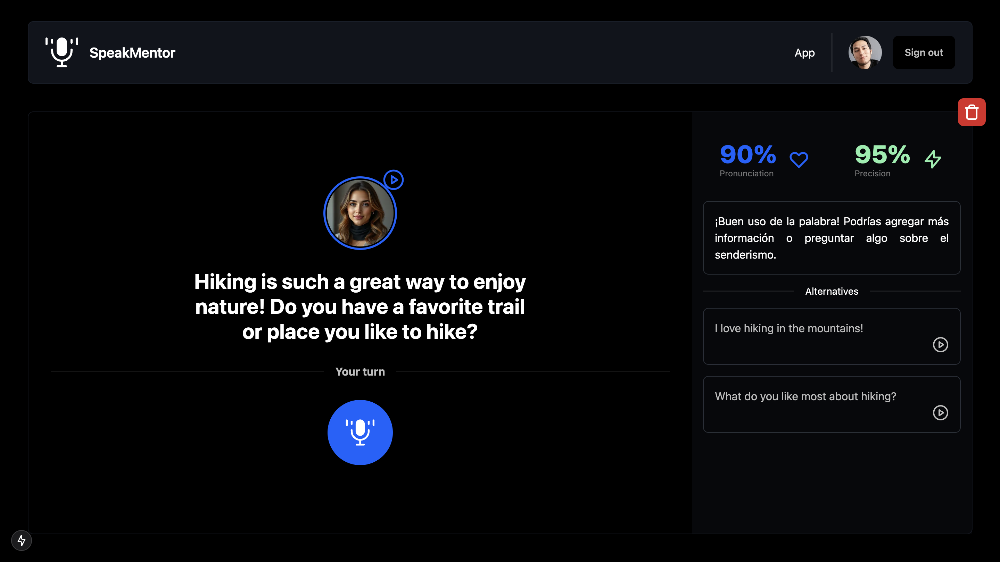

# SpeakMentor

SpeakMentor is an open-source platform designed to help users practice languages in an interactive and engaging way. Powered by AI, SpeakMentor provides personalized conversations, feedback, and exercises to improve language fluency and confidence.

## Features

- **AI-Powered Conversations**: Chat with an AI that provides realistic language practice.
- **Pronunciation Feedback**: Receive instant feedback on your pronunciation to help you sound more natural.
- **Open Source**: Contribute to the project and help build the future of language learning.

## Demo



Try the live demo here: [SpeakMentor Demo](https://speak-mentor.vercel.app/)

## Installation

To run SpeakMentor locally, follow these steps:

### Prerequisites

- [Next.js](https://nextjs.org/)
- [Supabase](https://supabase.com/)
- [OpenAI](https://openai.com/)
- [ElevenLabs](https://elevenlabs.io/)

### Steps

1. Clone the repository:

   ```bash
   git clone https://github.com/yourusername/speakmentor.git
   cd speakmentor
   ```

2. Install dependencies:

   ```bash
   pnpm install
   ```

3. Start the development server:

   ```bash
   pnpm run dev
   ```

4. Open your browser and navigate to:

   ```
   http://localhost:3000
   ```

## Deployment

To deploy SpeakMentor using Next.js:

1. Build the application:

   ```bash
   pnpm run build
   ```

2. Start the production server:

   ```bash
   pnpm start
   ```

3. For hosting, you can use platforms like [Vercel](https://vercel.com/). Simply connect your repository and follow their deployment guides.

## License

SpeakMentor is licensed under the [MIT License](LICENSE). Feel free to use, modify, and distribute this project as per the license terms.

## Roadmap

- Add support for more languages.
- Improve AI feedback for grammar and vocabulary.
- Introduce gamification elements (e.g., badges, leaderboards).

## Contact

For questions, feedback, or suggestions, feel free to reach out:

- Email: josepaulct@gmail.com
- GitHub Issues: [Open an Issue](https://github.com/yourusername/speakmentor/issues)
- X: [@JosePaulCT](https://x.com/josepaulct)

---
